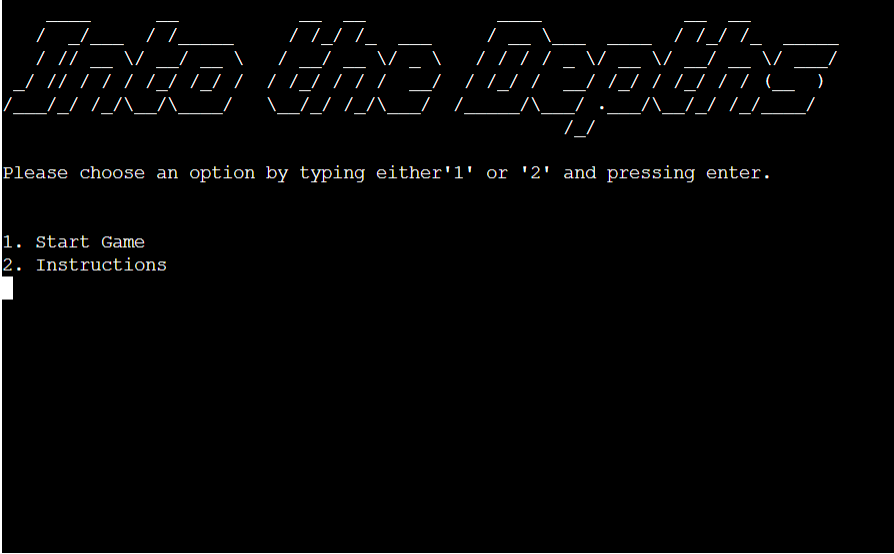
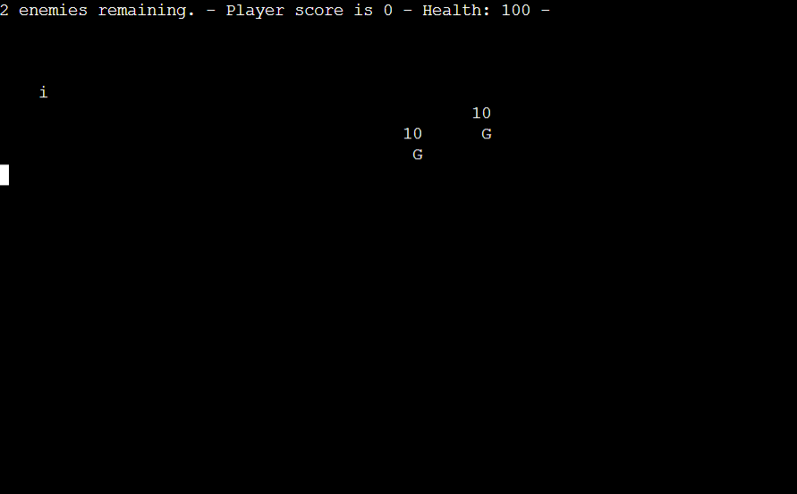
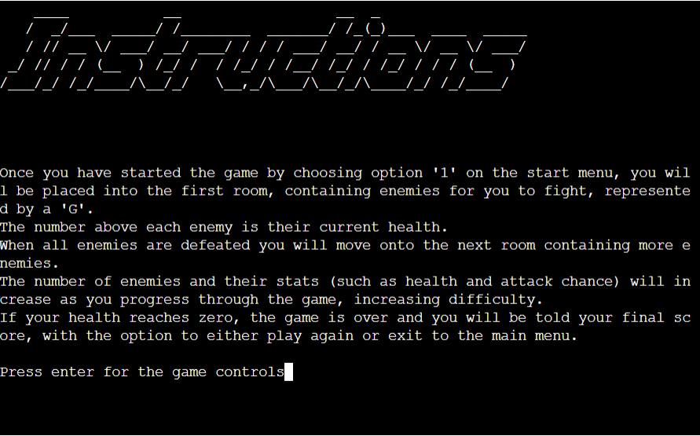
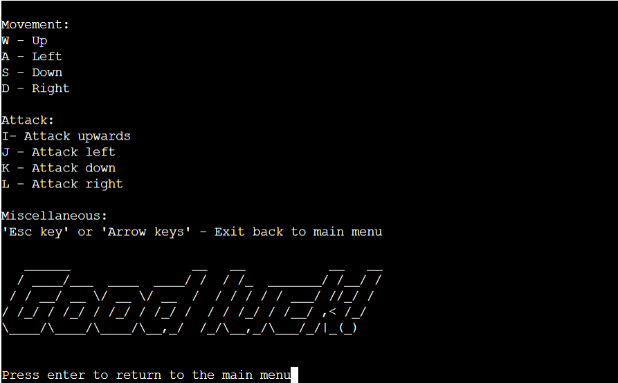
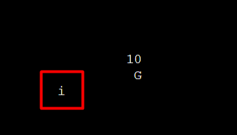
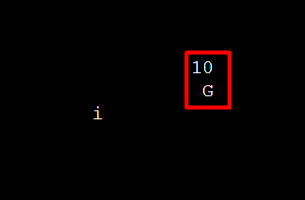
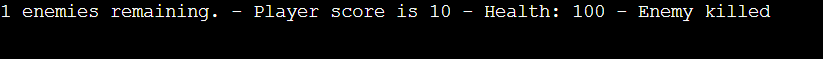
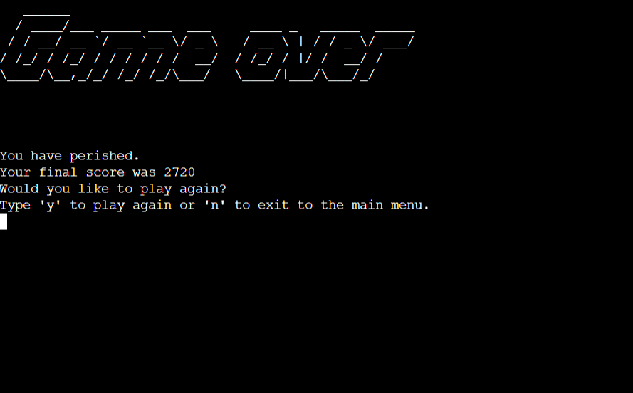
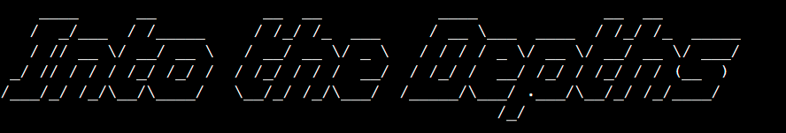

# Into the Depths - Project 3

Into the Depths is a Python based command-line game for Project 3 of the Code Insitute Full Stack Web Development course.

It is based on the 'roguelike' genre of games and utilises ASCII art in the command line as visual feedback for the user.

The deployed code can be found [here](https://ci-project-3-roguelike-game.herokuapp.com/)

## How To Play

Once the game is launched the user is first presented with the main menu where they may choose either from two options by entering either '1' or '2' as an input. '1' being 'Start Game' and '2' Being 'Instructions'.

The 'Instructions' option presents the user with mainly the same information included here, listing the purpose of the game and various controls, whilst the 'Start Game' option begins the main game.

The objective of the game is to navigate through a set of room or dungeons with progressively more difficult enemies to defeat to see how long the player can survive. As they play the game a 'score' is tallied up for actions such as killing an enemy or finishing a room which the player is shown upon the game ending.

The controls are as follows:

The W, A, S, D keys move the player Up, Left, Down or Right respectively
The I, J, K and L keys attack in their respective directions.
The 'Esc' key or Arrow keys exit the game back to the main menu. 

## Features

**Start menu**

* This is the first screen the player is presented with when starting the game. The game's name is displayed at the top using the Pyfiglet library and the user is presented with the choice of either 1: starting the game or 2: reading the instructions.
* The game then waits for an input where the user must type either '1' or '2'. Any other input will output an error to the user, reminding them to type either '1' or '2' to make a selection.

**Main game**

* Below is an example screenshot of the main game loop, which begins once the user enters '1' on the start menu.
* The player character, 2 enemies and the information panel are visible here, which are individual features of the game which will be explained further down.
* Once the player has killed all enemies on the screen, the room number increases and the new room is generated.

**Instructions page**

* If the user types '2' on the start menu, they are then presented with the following instructions page.
* Here, the game's objective is displayed on the first page. The program will then wait for the user to press enter before moving onto the second page.

* The second page tells the user the game's controls, again waiting for enter to be pressed before returning to the main menu.

**Player character**

* The player's character is represented by an 'i'. As stated in the instructions, they are able to move around using the 'W', 'A', 'S' and 'D' keys, as well as attack using the 'I', 'J', 'K' and 'L' keys. Any of these actions will end the player's turn, allowing the enemy to immediately take theirs.
* When within the range of 1 'char' or letter of an enemy, they may attempt an attack using the attack keys in the direction of the enemy. In this version of the game the player has a fixed hit chance of 33%.

**Enemies**

* Enemies are represented by the letter 'G' and have their current health displayed above them. When within visual range of the player (currently fixed to 5 characters) they will move towards them when it is their turn and if they are one character away will attempt an attack.
* They are randomly generated by the 'generate_room' method which uses the 'Enemy' class. Their health and hit chance scale up based on the current room number, increasing their difficulty as the player progresses through the game.

**Information panel**

* The information panel is displayed at the top of the screen throughout gameplay and provides feedback to the player, such as telling them the remaining number of enemies; their health; their current score and the outcome of recent actions such as attacks or killing enemies.
* This aids the player in understanding their progress in the game and important information such as their health, improving the user experience.

**Game over**

* Once the player's health reaches zero, they are presented with the 'Game Over' screen where they are told their final score, as well as given the option to type 'y' to play again or 'n' to return to the main menu.
* This allows the player to keep track of what scores they have achieved, adding a sense of replayability as they compete with themselves or others for a higher score.

### Future development and features

* Adding randomly generated items for the player to pick up which will aid them by increasing stats or allowing for actions such as healing. Having a limited inventory capacity for such items would introduce the additional aspect of inventory management, adding further depth to the gameplay.

## Classes

## Flow Control

* The following flow control diagram shows the initial plan for the game's logic, which aided in development when considering each part of the game and they would interact with eachother.
* Due to time constraints certain features were ommitted for the final release, which will be detailed below.

* Entering the user's name, the starting room to select initial gear and collecting items throughout the game were the main 3 features which did not make it to the final release. With more time, adding these features (particularly collecting items) would add to the progression and user experience of the game and so would be main goals for a potential future release.

## Aesthetic Design

* The game features a simple aesthetic design, making use of ASCII symbols such as the 'i' to represent the player.
* The 'Pyfiglet' library was used to emphasise pieces of text during the game's menus by turning them into ASCII art, making them stand out to the player.

### Future aesthetic changes

* My original plan for the game involved using the 'colorama' library to add colour to elements of the game, which would have made it easier for the player to differentiate between objects in the game, as well as provided an additional layer of visual feedback to the player, improving the game's general playability as well as the user experience.

## Libraries and Technology Used

**Built-in Libraries**

os

termios

sys

tty

math

random

**Third-party Libraries**

pyfiglet

## Testing

### Found issues/bugs

### Validator testing

## Deployment

### Version Control

## Credits