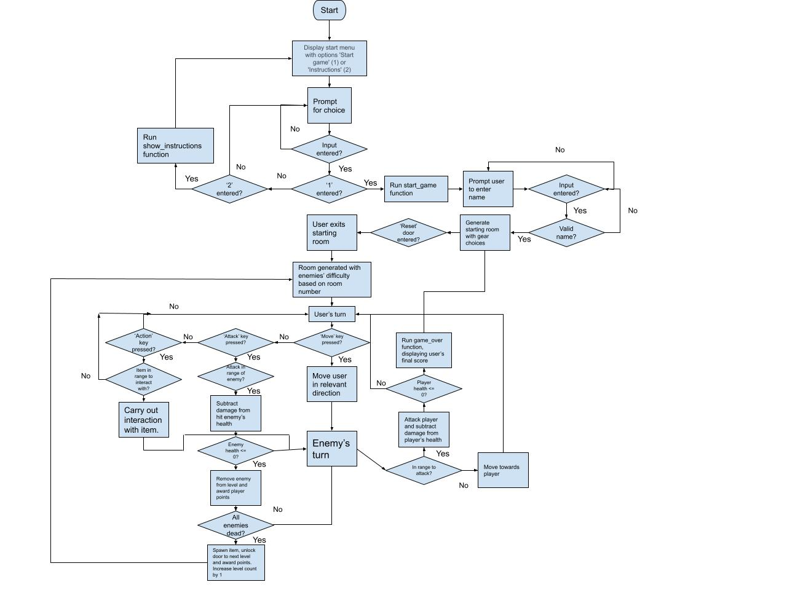

# Into the Depths - Project 3

Into the Depths is a Python based command-line game for Project 3 of the Code Insitute Full Stack Web Development course.

It is based on the 'roguelike' genre of games and utilises ASCII art in the command line as visual feedback for the user.

## How To Play

Once the game is launched the user is first presented with the main menu where they may choose either from two options by entering either '1' or '2' as an input. '1' being 'Start Game' and '2' Being 'Instructions'.

The 'Instructions' option presents the user with mainly the same information included here, listing the purpose of the game and various controls, whilst the 'Start Game' option begins the main game.

The objective of the game is to navigate through a set of room or dungeons with progressively more difficult enemies to defeat, picking up better equipment along the way to see how long the player can survive. As they play the game a 'score' is tallied up which the player is shown upon dying.

The controls are as follows:

W, A, S, D keys move the player Up, Left, Down or Right respectively
The Up, Down, Left or Right arrows keys attack in their respective directions.
The 'E' key allows the user to interact with the item they are stood over, such as a chest or door.
The 'I' key opens the player's inventory, where they can equip items they have collected whilst playing.
 
## User Experience

### User Stories

## Features

### Future development and features

## Classes

## Flow Control

## Aesthetic Design

## Libraries and Technology Used

**Built-in Libraries**

**Third-party Libraries**

## Testing

### Found issues/bugs

### Validator testing

## Deployment

### Version Control

## Credits